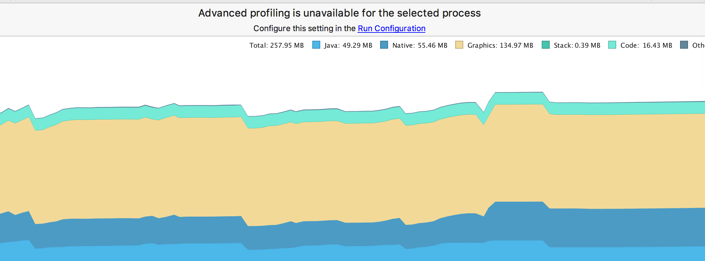

# 微仿glide

## 效果图

  


## 加载整个手机的图片后内存还算稳定



 1。自动支持gif

 2。自动绑定生命周期(1.页面关闭时未完成的任务自动取消 2.页面不可见时gif自动停止加载，可见时自动恢复)

 3。支持网络图 assets resource 本地file

 4。设置缓存策略ALL,MEMORY,NONE

 5。自带简单的头像识别剪裁(显示头像时可以用)，模糊处理


    ```
    allprojects {
		repositories {
			...
			maven { url 'https://jitpack.io' }
		}
	}
	dependencies {
    	        implementation 'com.github.wangdanlizhiyun:imageLoader:1.0.1'
    }
    ```


 在application里初始化
    ```
        ImageCache.getInstance().init(this,getCacheDir().getAbsolutePath()+"/image");
                ImageLoader.placeHolder = new LoadingDrawable(BitmapFactory.decodeResource(getResources(), R.drawable.loading_gray));
                ImageLoader.errorDrawable = new FailedDrawable(Color.RED);
    ```
  使用示例

  ```
    ImageLoader.with(that).load(TDSystemGallery.sList.get(position).getPath()).placeHolder(loadingDrawable)
                                    .errorDrawable(errorDrawable)

                                    .size(Util.getScreenWidth(that) / 3, Util.getScreenWidth(that) / 3)
                                    .into(imageView);

    ImageLoader.with(this).load("https://ss0.bdstatic.com/70cFvHSh_Q1YnxGkpoWK1HF6hhy/it/u=823222274,759908896&fm=27&gp=0.jpg")
                    .diskCacheStrategy(BitmapRequestBuilder.DiskCacheStrategy.NONE)
                    .face()
                    .blur(3)
                    .into(imageView1);
     ImageLoader.with(this).loadAsserts("mp.gif").into(imageView2);
     ImageLoader.with(this).errorDrawable(null).load(R.drawable.xiaosong).into(imageView3);
     ImageLoader.with(this).errorDrawable(null).load(R.drawable.g).into(imageView4);
  ```


